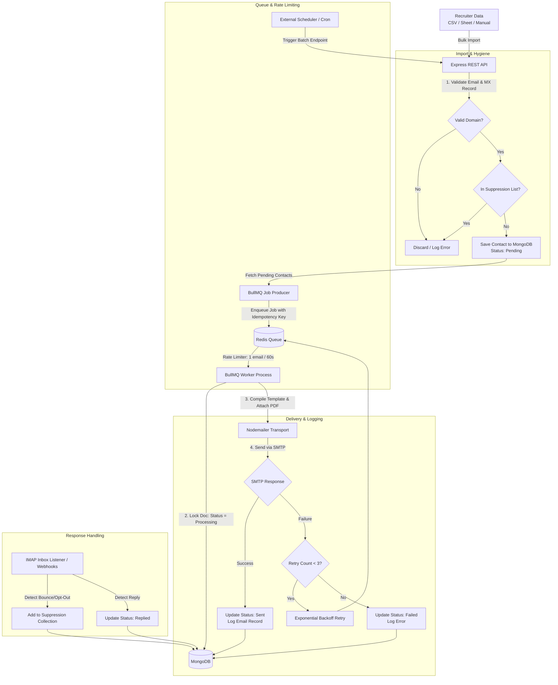
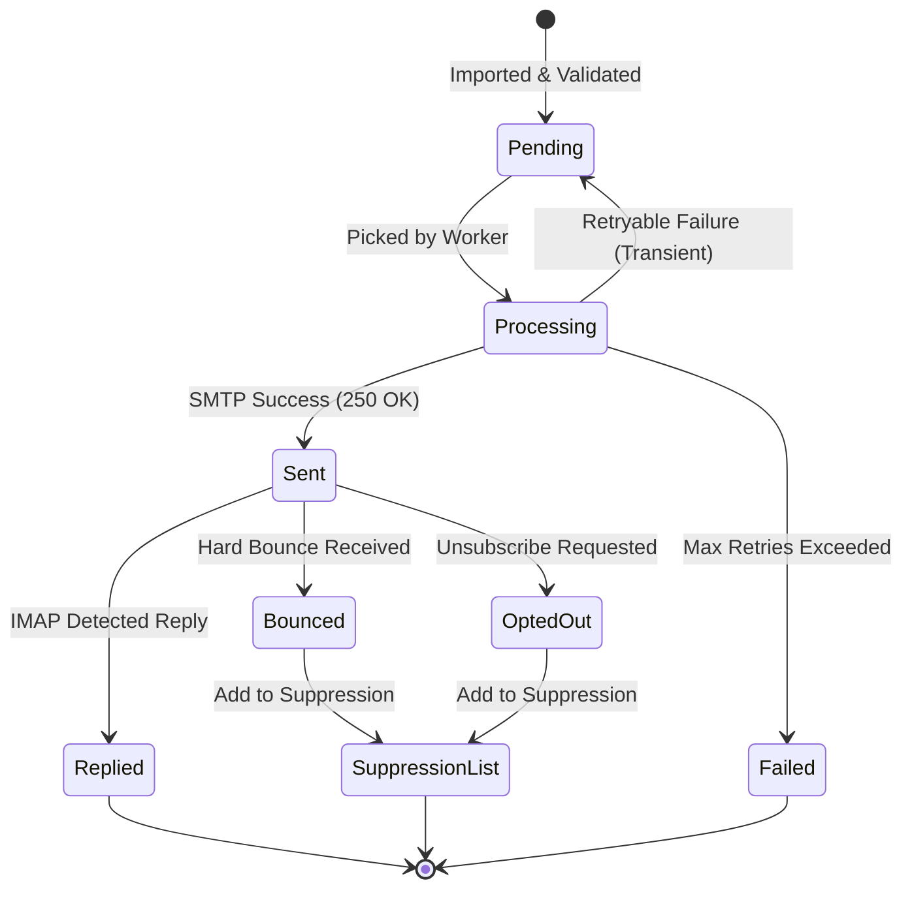

# 🤖 Automated Cold-Email Job Outreach Bot

An automated, low-volume, rate-limited email outreach pipeline built with **Node.js, Express, MongoDB, and BullMQ**. Designed specifically for job seekers to reach out to recruiters with personalized templates, resume attachments, and robust deliverability controls.

> **📌 Purpose & Etiquette Notice**  
> This tool is intended for low-volume, personalized, opt-out-friendly outreach. It includes strict rate-limiting, domain validation, and global suppression tracking to ensure compliance and maintain sender reputation. **Do not use this for bulk spam.**

---

## 📋 Table of Contents
1. [Tech Stack](#1-tech-stack)
2. [System Architecture & Data Flow](#2-system-architecture--data-flow)
3. [Core Database Schemas](#3-core-database-schemas)
4. [REST API Documentation](#4-rest-api-documentation)
5. [Build Roadmap](#5-build-roadmap)
6. [Deliverability & Etiquette Guidelines](#6-deliverability--etiquette-guidelines)

---

## 1. Tech Stack

| Category | Technology | Purpose |
|---|---|---|
| **Runtime** | Node.js (v20+) | Core execution environment |
| **Framework** | Express.js | Minimalist REST API layer |
| **Database** | MongoDB + Mongoose | Primary document store for contacts & logs |
| **Queue & Cache** | Redis + BullMQ | Background job queue, rate-limiting, & retries |
| **Transport** | Nodemailer | SMTP client (Gmail App Password / SendGrid) |
| **Domain Safety** | Native `dns` (MX Lookups) | Pre-send email syntax & MX domain validation |

---

## 2. System Architecture & Data Flow

### System Data Flow Diagram



### Contact State Machine



---

## 3. Core Database Schemas

### Company / Contact Schema (`Company.js`)

```js
import mongoose from 'mongoose';

const companySchema = new mongoose.Schema({
  companyName: { type: String, required: true, trim: true },
  hrName:      { type: String, trim: true },
  hrEmail:     { type: String, required: true, unique: true, lowercase: true, trim: true },
  jobTitle:    { type: String, required: true, trim: true },
  jobPostUrl:  { type: String, trim: true },
  source:      { type: String, default: 'LinkedIn' },
  status: { 
    type: String, 
    enum: ['Pending', 'Processing', 'Sent', 'Failed', 'Replied', 'Bounced', 'OptedOut'], 
    default: 'Pending' 
  },
  idempotencyKey: { type: String, unique: true, sparse: true },
  retryCount:     { type: Number, default: 0 },
  lastError:      { type: String },
  sentAt:         { type: Date },
  repliedAt:      { type: Date }
}, { timestamps: true });

export const Company = mongoose.model('Company', companySchema);

```

### Global Suppression Schema (`Suppression.js`)

```js
import mongoose from 'mongoose';

const suppressionSchema = new mongoose.Schema({
  email:     { type: String, required: true, unique: true, lowercase: true, trim: true },
  reason:    { type: String, enum: ['Bounce', 'OptOut', 'Manual'], required: true },
  createdAt: { type: Date, default: Date.now }
});

export const Suppression = mongoose.model('Suppression', suppressionSchema);

```

---

## 4. REST API Documentation

| Method | Endpoint | Description | Payload / Parameters |
| --- | --- | --- | --- |
| `POST` | `/api/companies` | Add a single recruiter manually | `{ companyName, hrName, hrEmail, jobTitle }` |
| `POST` | `/api/companies/import` | Bulk upload CSV recruiter list | `multipart/form-data` (CSV file) |
| `GET` | `/api/companies` | Retrieve contacts (filterable) | Query params: `?status=Pending&page=1` |
| `POST` | `/api/queue/dispatch` | Trigger queue batching worker | `{ batchSize: 10 }` |
| `PATCH` | `/api/companies/:id/status` | Update status manually | `{ status: "Replied" }` |
| `GET` | `/api/stats` | Retrieve aggregate campaign metrics | Returns: `{ sent, replied, bounced, rate }` |

---

## 5. Build Roadmap

* [x] **Phase 1: Foundation Setup**
* Setup Express, Mongoose connection, and MongoDB schemas.
* Implement syntax validation and native MX record lookups on input (`dns.resolveMx`).


* [ ] **Phase 2: Queue & Worker Integration**
* Integrate Redis and BullMQ.
* Configure rate limiting on the worker (`max: 1` per `60000ms`).
* Add locking mechanisms using `idempotencyKey` state update transitions.


* [ ] **Phase 3: Templating & Delivery**
* Setup Nodemailer with HTML templates and standard resume attachments.
* Implement failure handling with backoff retries.


* [ ] **Phase 4: Tracking & Dashboard**
* Add an IMAP listener to flag replies and bounces automatically.
* Expose aggregate metrics via `/api/stats`.


---

## 6. Deliverability & Etiquette Guidelines

1. **Pacing:** Keep batch sizes low (20–30 emails/day max for regular Gmail accounts).
2. **Spacing:** Maintain a minimum 60-second delay between consecutive sends to prevent ISP spam throttling.
3. **Personalization:** Populate dynamic fields (`{{hrName}}`, `{{companyName}}`, `{{jobTitle}}`) in all email bodies.
4. **Opt-Out Compliance:** Include a clean footer allowing recipients to opt out, and ensure opt-out addresses are saved directly to the `Suppression` database collection.
